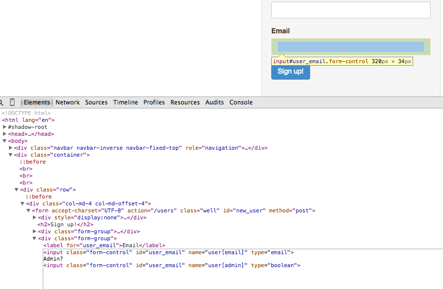
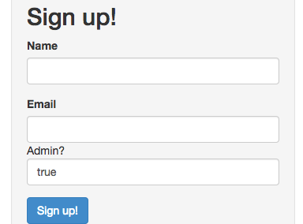
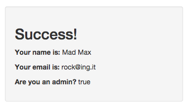

# Make yourselves an admin user!

Using _only_ the chrome web inspector, take your knowledge of how HTML inputs and
Rails params work, and craft a request that can make users admin users.

Open inspect elements, and modify the code to create a new field.

After adding the field we can type a "boolean" response since we dictated the type as boolean.
(This is because I suspect this to be a boolean in the database)

Here we have a new field:

Success:

